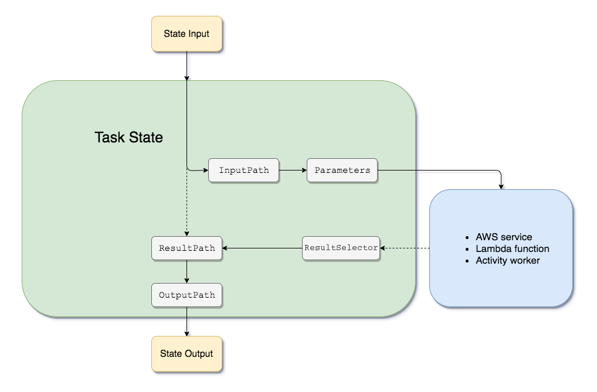

# Step Functions Input and Ouput full example

## Having this Raw Input

```json
// Raw Input
{
    "first": "1",
    "second": "2",
    "third": {
        "four": "4",
        "fifth": "5"
    }
}
```
 ## Having this task output

 ```json
 // State Output
{
    "ExecutedVersion": "$LATEST",
    "Payload": {
      "that": "is true",
      "this": false
    },
    "SdkHttpMetadata": {
      "AllHttpHeaders": {
        "X-Amz-Executed-Version": [
          "$LATEST"
        ],
        "x-amzn-Remapped-Content-Length": [
          "0"
        ],
        "Connection": [
          "keep-alive"
        ],
        "x-amzn-RequestId": [
          "x"
        ],
        "Content-Length": [
          "91"
        ],
        "Date": [
          "Thu, 21 Jan 2021 09:07:41 GMT"
        ],
        "X-Amzn-Trace-Id": [
          "x"
        ],
        "Content-Type": [
          "application/json"
        ]
      },
      "HttpHeaders": {
        "Connection": "keep-alive",
        "Content-Length": "91",
        "Content-Type": "application/json",
        "Date": "Thu, 21 Jan 2021 09:07:41 GMT",
        "X-Amz-Executed-Version": "$LATEST",
        "x-amzn-Remapped-Content-Length": "0",
        "x-amzn-RequestId": "x",
        "X-Amzn-Trace-Id": "x"
      },
      "HttpStatusCode": 200
    },
    "SdkResponseMetadata": {
      "RequestId": "x"
    },
    "StatusCode": 200
  }
  ```
## And this State definition

```json
// State Definition
{
    "Type": "Task",
    "Resource": "arn:aws:states:::lambda:invoke",
    "InputPath": "$.third", // Extract from Raw input and create InputPath
    "Parameters": { // Extract from Input Path
        "FunctionName": "arn:aws:lambda:us-east-1:123456789012:function:sendHttpRequest:$LATEST",
        "Payload": {
            "parameter1": "fixed",
            "parameter2.$": "$.four",
            "parameter3.$": {
                "stateName": "$$.State.Name"
                // "invalid.$": "$.first" 
            }
        }
    },
    "ResultSelector": { // Select only a part of the task output
        "Payload.$": "$.Payload",
        "StatusCode.$": "$.StatusCode"
    },
    "ResultPath": "$.TaskOutput", // Insert the ResultSelecto into rawInput
    "Next": "Create the Branch"
}
```

## Effective State input

```json
{
"parameter1": "fixed",
"parameter2": "four",
"parameter3": {
    "stateName": "<theRealStateName>"
    // "invalid.$": "$.first" 
}
```

## Input for the next State
```json
// Next state input
{
    "first": "1",
    "second": "2",
    "third": {
        "four": "4",
        "fifth": "5"
    },
    "TaskOutput": {
        "Payload": {
            "that": "is true",
            "this": false,
            "result": {
                "Action": "Do the code",
                "code": "This is the code"
            }
        },
        "StatusCode": 200
    }
}
```

